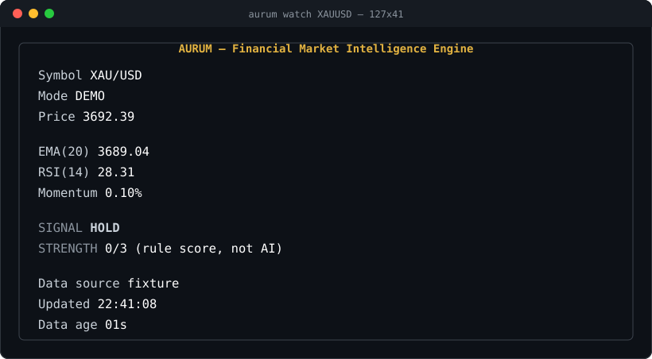

<div align="center">

# Aurum

**Financial market intelligence engine for gold (XAU/USD) — one Rust binary: CLI, REST API, and terminal UI.**

[](https://github.com/BTF-Kabir-2020/aurum-rs/actions/workflows/ci.yml)
[](LICENSE)
[](rust-toolchain.toml)

Clone → demo → see the engine work. No API key, no network, no setup.

</div>

---

## What it is

Aurum pulls market data with **your own** provider key, computes the classic technical indicators **entirely in Rust**, and produces an explicit **BUY / SELL / HOLD** rule signal together with the exact conditions that produced it. Every quote, candle, and signal is persisted in your own SQLite file.

Aurum is an **analysis and research tool**:

- It does **not** place trades and does **not** manage money.
- Its rules are **fixed, documented, and readable** — it is never called "AI".
- It makes **no** profit or accuracy claims.

> New here? The original build specification lives in [`docs/SPEC.md`](docs/SPEC.md); progress and frozen decisions are in [`HANDOFF.md`](HANDOFF.md).

## Features

- **Three modes** — `DEMO` (offline, bundled fixture), `HISTORICAL` (real provider bars), `LIVE` (planned; never simulated).
- **Indicators** — EMA(20), RSI(14) and Momentum, implemented as pure, independently tested Rust functions.
- **Rule engine** — transparent BUY/SELL/HOLD with the matched condition matrix exposed in every response.
- **Terminal UI** — a clean `ratatui`/`crossterm` screen via `aurum watch`.
- **REST API** — versioned `/api/v1/...` endpoints on `axum`.
- **Storage** — SQLite (WAL) with dedupe and retention; `backup create | verify | restore`.
- **Provider abstraction** — a Massive adapter plus a deterministic offline replay provider; swap providers without touching the engine.
- **Resilience** — timeouts, bounded retries with backoff, `Retry-After` handling, and stale-cache tagging.
- **Ship it** — Docker image, cross-platform binaries and installers via `cargo-dist`.

## Quick Start

```bash
git clone https://github.com/BTF-Kabir-2020/aurum-rs
cd aurum-rs
cargo run -- demo        # offline: fixture → indicators → signal, no key needed
```

Then explore the API:

```bash
cargo run -- server                          # http://127.0.0.1:8080
curl http://127.0.0.1:8080/api/v1/status
curl http://127.0.0.1:8080/api/v1/signal/XAUUSD
```

One-command showcase: `./scripts/demo.sh` (or `.\scripts\demo.ps1` on Windows).

## Demo

`aurum watch XAUUSD` renders a live screen:



```
┌───────────────────────────────────────────────┐
│      AURUM — Financial Market Intelligence Engine │
├───────────────────────────────────────────────┤
│ Symbol       XAU/USD                          │
│ Mode         DEMO                             │
│ Price        3692.39                          │
│                                               │
│ EMA(20)      3689.04                          │
│ RSI(14)      28.31                            │
│ Momentum     0.10%                            │
│                                               │
│ SIGNAL       HOLD                             │
│ STRENGTH     0/3 (rule score, not AI)         │
│                                               │
│ Data source  fixture                          │
│ Updated      22:41:08                         │
│ Data age     01s                              │
└───────────────────────────────────────────────┘
```

`aurum demo --speed 10` replays 240 deterministic gold candles through the full pipeline — bounded, offline, and screenshot-friendly.

## Historical Mode

Use your own [Massive](https://massive.com) key for real bars. Aurum never redistributes provider data:

```bash
export MASSIVE_API_KEY=your_key_here     # or put it in a gitignored .env
cargo run -- history XAUUSD
cargo run -- signal XAUUSD
```

## Live Mode

Live WebSocket ingestion is on the roadmap (v0.2), not in v0.1. Aurum **never** simulates live data: if live access is unavailable, it reports a clear provider/plan error while `DEMO` and `HISTORICAL` keep working.

## Docker

Two first-class modes — native and Docker — run the same binary.

```bash
docker compose up -d
docker compose logs -f
curl http://127.0.0.1:8080/health/live
```

`./data` and `./backups` are mounted for persistence. The runtime image is slim and non-root.

## Native Installation

```bash
cargo install --path .
aurum demo
```

Published releases ship prebuilt archives and `install.sh` / `install.ps1` (Windows, Linux, macOS) so users don't need to compile Rust.

## CLI Examples

```
aurum demo [--speed N]          # offline demonstration
aurum doctor                    # environment + config diagnostics
aurum quote XAUUSD              # latest quote
aurum history XAUUSD            # historical candles
aurum signal XAUUSD             # rule signal + conditions
aurum watch XAUUSD              # terminal UI
aurum server                    # REST API
aurum config show|validate|init
aurum backup create|verify|restore
aurum version
```

Symbol aliases (`XAUUSD`, `XAU/USD`, `C:XAUUSD`, `xauusd`) normalize to one canonical form.

## API Examples

```bash
curl http://127.0.0.1:8080/health/live
curl http://127.0.0.1:8080/health/ready
curl http://127.0.0.1:8080/api/v1/status
curl http://127.0.0.1:8080/api/v1/quote/XAUUSD
curl http://127.0.0.1:8080/api/v1/history/XAUUSD?limit=100
curl http://127.0.0.1:8080/api/v1/signal/XAUUSD
```

Signal response (shape):

```json
{
  "symbol": "XAU/USD",
  "mode": "demo",
  "timestamp": "2026-09-20T00:00:00Z",
  "price": 3681.42,
  "indicators": { "ema20": 3694.12, "rsi14": 28.31, "momentum": -1.21 },
  "signal": { "action": "BUY", "strength": 2, "max_strength": 3 },
  "data": { "source": "fixture", "stale": false }
}
```

## Configuration

Aurum reads `config.toml` with environment overrides. Secrets are never committed and never logged; `config show` redacts them.

```toml
[app]
mode = "demo"
symbol = "XAUUSD"
timeframe = "5m"

[server]
host = "127.0.0.1"
port = 8080

[database]
path = "./data/aurum.db"

[provider]
name = "massive"

[ui]
refresh_ms = 1000
```

See [`config.example.toml`](config.example.toml), [`.env.example`](.env.example) and [`docs/CONFIGURATION.md`](docs/CONFIGURATION.md).

## Backup / Restore

```bash
aurum backup create --output ./backups/my-backup.db
aurum backup verify ./backups/my-backup.db
aurum backup restore ./backups/my-backup.db
```

Backups are consistent SQLite snapshots (`VACUUM INTO`); restore validates integrity and keeps a safety copy before replacing anything.

## Testing

Network-free quality gates (no personal API key required):

```bash
cargo fmt --all -- --check
cargo check --all-targets --all-features
cargo clippy --all-targets --all-features -- -D warnings
cargo test --all-targets --all-features   # 106 tests (unit + integration)
cargo audit
cargo deny check
```

Provider HTTP behavior is tested against recorded fixtures under `fixtures/provider/`, so upstream API changes can't silently break the suite.

## Architecture

```
Provider → Market models → Indicators → Signal engine → SQLite → API / TUI
```

| Layer | Crate / module |
|---|---|
| Async runtime | `tokio` |
| HTTP client | `reqwest` (rustls + ring) |
| API | `axum` + `tower-http` |
| CLI | `clap` |
| Terminal UI | `ratatui` + `crossterm` |
| Storage | `sqlx` + SQLite (WAL) |
| Errors | `thiserror` / `anyhow` |
| Tracing | `tracing` + `tracing-subscriber` |

Details: [`docs/ARCHITECTURE.md`](docs/ARCHITECTURE.md).

## Roadmap

- **v0.2** — live WebSocket ingestion
- **v0.3** — multi-symbol (BTC, ETH, EUR/USD, GBP/USD)
- **v0.4** — backtesting and rule-score history
- **v0.5** — advanced risk analytics
- **v1.x** — optional web dashboard

## Limitations

- **Intraday (5-minute) data depends on the provider plan.** The free/daily tier returns HTTP 403 for 5m bars and `last_quote`; Aurum reports this clearly and never relabels daily data as 5-minute.
- **Live streaming and multi-symbol support are not in v0.1** (see roadmap).
- **No authentication or user accounts** — the server binds to localhost by default.
- **No trading/execution and no ML** by design.

## Data Provider / Licensing Notes

- Aurum is **software**; it does **not** own or redistribute third-party market data.
- All data access is **BYO-provider-access** — you supply your own credentials.
- The public `DEMO` mode uses a bundled synthetic fixture and needs no network.

See [`docs/PROVIDERS.md`](docs/PROVIDERS.md) and [`DISCLAIMER.md`](DISCLAIMER.md).

## Disclaimer

Aurum is a market **analysis and research** tool. It is not financial advice, it does not execute trades, and its signals are transparent rule output — not predictions or guarantees. Read the full [`DISCLAIMER.md`](DISCLAIMER.md).

---

<div align="center">

MIT licensed · [Contributing](CONTRIBUTING.md) · [Security](SECURITY.md) · [Docs](docs/README.md)

</div>
