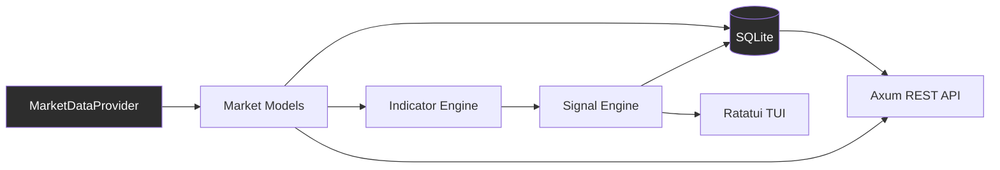

# Architecture

Aurum is a Rust-based financial market intelligence engine. This page covers the v0.1 architecture: the data flow, the module map, and the provider boundary.

## Data flow

```
Provider
   ↓
Market models (Candle, Quote)
   ↓
Indicators (EMA, RSI, Momentum)
   ↓
Signal engine (BUY / SELL / HOLD)
   ↓
Storage (SQLite)
   ↓
API (Axum) / TUI (Ratatui)
```

> SMA and SMMA/RMA are internal indicator primitives used by EMA and RSI;
> they are not additional signal indicators in v0.1.



## Module responsibilities

| Module | Responsibility |
|---|---|
| `main.rs` | Startup and orchestration (clap dispatch) |
| `config.rs` | Configuration loading/validation |
| `error.rs` | Typed error types (`thiserror` / `anyhow`) |
| `state.rs` | Shared application state: provider selection + storage wiring |
| `market/models.rs` | `Candle`, `Quote`, canonical symbol model |
| `market/provider.rs` | `MarketDataProvider` trait (provider contract) |
| `market/massive.rs` | Massive provider adapter (HTTP + auth, provider-specific) |
| `market/replay.rs` | Offline deterministic demo/replay provider |
| `indicators/sma.rs` | SMA, windowed-mean foundation |
| `indicators/smma.rs` | Wilder Smoothed MA (RMA/SMMA), base of RSI |
| `indicators/ema.rs` | EMA(20), pure calculation (SMA-seeded) |
| `indicators/rsi.rs` | RSI(14), pure calculation (SMMA-smoothed) |
| `indicators/momentum.rs` | Moment change %, pure calculation |
| `signal/engine.rs` | Rule-based BUY/SELL/HOLD + strength |
| `storage/db.rs` | SQLx + SQLite connection, WAL, migrations |
| `storage/repository.rs` | Data access for candles/quotes/signals |
| `storage/backup.rs` | backup create (VACUUM INTO) / verify / restore |
| `cli/*` | Clap commands (demo, doctor, init, config, market, backup) |
| `api/routes.rs` | Axum endpoints + DTOs |
| `tui/*` | Ratatui/Crossterm live screen |

## Provider abstraction

Nothing outside the provider layer talks to Massive. Every data source implements the same `MarketDataProvider` trait:

```
MarketDataProvider
    ├── AlphaVantageProvider   (considered, not used for v0.1)
    ├── MassiveProvider        (v0.1 HISTORICAL + LIVE)
    ├── ReplayProvider         (v0.1 DEMO)
    └── ...future providers
```

The signal engine must not know URL formats, query parameters, JSON field names, or authentication details of any provider.

## Modes

- **DEMO**: bundled fixture, offline, no credentials.
- **HISTORICAL**: Massive Currencies API, user's own credentials.
- **LIVE**: Massive Forex WebSocket, plan permitting. Never simulated.

Every market result is tagged with source, timestamp, age, and staleness.

## Out of scope (v0.1)

Microservices, Kubernetes, Redis, Kafka, message queue, GraphQL, frontend, auth platform, payments, ML, blockchain. None of this ships in v0.1. Anything planned lives in the roadmap and nowhere else.